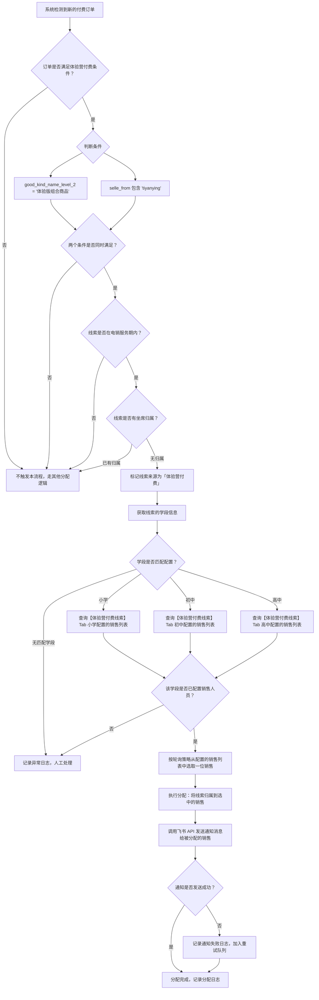

# 体验营付费线索自动分配 PRD

## 一、修订记录

| 版本号 | 修改日期 | 修改原因 | 修订人 |
|--------|----------|----------|--------|
| v1.0 | 2026-03-31 | 初稿 | AI PRD Writer |

## 二、需求概述

### 背景/现状

当前 CRM 系统「系统管理 > 选择坐席」页面（`/WH_CRM_v2/system/selectAgent/index`）用于配置各业务场景下线索的坐席分配规则。现有 Tab 包括「线索品」「裂变分配设置」等，支持按学段维度为不同类型的线索配置承接销售人员。

目前存在一个场景缺少配置入口：**在电销服务期内，没有坐席归属的用户通过体验营渠道购买了体验课（体验版组合商品）**，这类线索具有较高的购课意向，但因没有归属坐席而无法被及时跟进，造成高价值线索流失。

### 需求目标

1. 在「系统管理 > 选择坐席」页面新增一个 Tab【体验营付费线索】，支持按学段（小学、初中、高中）配置承接销售人员。
2. 系统自动识别在电销服务期内购买体验营体验课且无坐席归属的线索，根据线索学段信息自动分配到【体验营付费线索】Tab 下配置的对应销售。
3. 分配完成后自动发送飞书消息通知对应销售，确保高意向线索得到及时跟进。

### 核心逻辑简述

在「选择坐席」页面新增【体验营付费线索】Tab，展示形式同现有的【线索品】Tab，以学段维度展示配置表格（小学、初中、高中），每个学段可编辑配置承接人员。后端新增定时任务或事件监听，当系统检测到满足条件的体验营付费线索（`good_kind_name_level_2 = '体验版组合商品'` 且 `selle_from` 包含 `'tiyanying'`、处于电销服务期内且无坐席归属）时，根据线索学段匹配该 Tab 下配置的销售人员，自动完成分配并发送飞书通知。

## 三、术语表

| 术语 | 定义 |
|------|------|
| 选择坐席 | CRM 系统配置页面，用于配置不同业务场景下线索分配给哪些销售人员 |
| 线索品 | 选择坐席页面的一个已有 Tab，按学段维度配置各学段的承接销售人员 |
| 体验营付费线索 | 在电销服务期内、无坐席归属、购买了体验营体验课的线索，本次新增的 Tab 及分配规则 |
| 体验营体验课 | 满足 `good_kind_name_level_2 = '体验版组合商品'` 且 `selle_from` 包含 `'tiyanying'` 的课程商品 |
| good_kind_name_level_2 | 商品二级分组名称字段，用于标识商品所属的分组类别 |
| selle_from | 销售来源字段，标识线索/订单的来源渠道 |
| 电销服务期 | 电销业务的有效服务时间段，在此期间系统对线索进行坐席分配和跟进管理 |
| 学段 | 学生所处的教育阶段，本需求涉及：小学、初中、高中 |
| 坐席归属 | 线索当前所分配的负责销售人员，"无坐席归属"表示线索尚未被分配给任何销售 |
| 飞书通知 | 通过飞书机器人或 API 向指定人员发送即时消息通知 |

## 四、调整范围

| 序号 | 功能模块 | 调整说明 |
|------|----------|----------|
| 1 | 选择坐席页面 — Tab 栏 | 新增：【体验营付费线索】Tab，位于现有 Tab 之后 |
| 2 | 体验营付费线索 Tab — 学段配置表格 | 新增：展示小学、初中、高中三个学段的承接人员配置列表，支持编辑 |
| 3 | 体验营付费线索 Tab — 编辑弹窗 | 新增：点击编辑按钮弹出人员选择弹窗，可选择/移除承接销售人员 |
| 4 | 后端 — 体验营付费线索识别 | 新增：识别满足条件的体验营付费线索（商品分组 + 来源 + 服务期 + 无归属） |
| 5 | 后端 — 自动分配逻辑 | 新增：根据线索学段匹配 Tab 配置的销售人员，执行自动分配 |
| 6 | 后端 — 飞书消息通知 | 新增：分配完成后向被分配的销售发送飞书消息通知 |
| 7 | 后端 — 配置接口 | 新增：体验营付费线索 Tab 下学段-销售人员配置的增删改查接口 |

## 五、业务流程图

### 5.1 配置流程

```mermaid
flowchart TD
    A[管理员进入「系统管理 > 选择坐席」页面] --> B[点击【体验营付费线索】Tab]
    B --> C[展示学段配置列表：小学/初中/高中]
    C --> D{管理员点击某学段的「编辑」按钮}
    D --> E[弹出人员选择弹窗]
    E --> F[管理员勾选/取消勾选销售人员]
    F --> G[点击「确定」保存配置]
    G --> H{保存是否成功？}
    H -->|是| I[刷新列表，展示最新承接人员]
    H -->|否| J[Toast 提示"保存失败，请重试"]
    J --> E
    I --> K[配置完成]
```

### 5.2 线索自动分配流程



### 5.3 飞书通知消息流程

```mermaid
flowchart TD
    A[线索分配完成] --> B[组装飞书消息内容]
    B --> C[消息标题：分配了一条体验营付费线索，请前往跟进。]
    B --> D[手机号：线索手机号（中间四位脱敏）]
    B --> E[支付时间：订单支付时间]
    B --> F[归属坐席：@被分配的销售姓名]
    B --> G[备注：该线索在电销服务期内购买了体验营的体验课...]
    C & D & E & F & G --> H[调用飞书机器人 Webhook / Open API 发送消息]
    H --> I{发送结果}
    I -->|成功| J[记录通知成功日志]
    I -->|失败| K[记录失败日志，3次重试]
    K --> L{重试是否成功？}
    L -->|是| J
    L -->|否| M[告警通知管理员]
```

## 六、可交互原型

在线预览：[点击查看可交互原型](https://yping-98.github.io/experience-camp-paid-leads/%E4%BD%93%E9%AA%8C%E8%90%A5%E4%BB%98%E8%B4%B9%E7%BA%BF%E7%B4%A2-%E4%BA%A4%E4%BA%92%E5%8E%9F%E5%9E%8B.html)

> 原型为可交互 HTML 页面，点击链接即可在浏览器中体验完整交互流程。

## 七、功能需求详细描述

### 7.1 选择坐席页面 — 新增 Tab

| 功能按钮 | 功能说明 | 是否必填 | 功能类型 | 交互说明 | 备注 |
|----------|----------|----------|----------|----------|------|
| 体验营付费线索 Tab | 进入体验营付费线索的学段坐席配置页 | — | Tab 切换按钮 | 点击后切换到体验营付费线索配置内容区；Tab 高亮激活态；与其他 Tab 互斥 | 位于现有 Tab（如线索品、裂变分配设置等）之后，页面路径不变 |

**Tab 状态说明：**

- 默认态：文字色 #666，无底部高亮线
- Hover 态：文字色 #1890ff
- 激活态：文字色 #1890ff，底部 2px 蓝色高亮线，font-weight: 500

### 7.2 体验营付费线索 Tab — 学段配置表格

**表格结构：**

| 字段名称 | 字段说明 | 字段来源 | 备注 |
|----------|----------|----------|------|
| 客户学段 | 学段名称 | 固定枚举 | 固定三行：小学、初中、高中 |
| 承接人员 | 该学段下配置的承接销售人员姓名列表 | 后端接口返回 | 多人以逗号分隔展示；未配置时展示"—" |
| 操作 | 编辑按钮 | — | 点击进入编辑弹窗 |

**表格交互规则：**

- 表格固定三行数据（小学、初中、高中），不支持新增/删除行
- 承接人员字段展示该学段下所有已配置销售的姓名，以 ", " 分隔
- 当承接人员为空时，展示"—"
- 操作列固定居中对齐

| 功能按钮 | 功能说明 | 是否必填 | 功能类型 | 交互说明 | 备注 |
|----------|----------|----------|----------|----------|------|
| 编辑 | 编辑该学段的承接人员配置 | — | 操作按钮 | 点击弹出人员选择弹窗，弹窗标题展示当前学段名称；编辑完成后刷新该行数据 | 按钮样式：蓝色边框按钮，hover 变蓝色实心 |

### 7.3 编辑弹窗 — 人员选择

弹窗结构与现有「线索品」Tab 的编辑弹窗保持一致。

| 功能按钮 | 功能说明 | 是否必填 | 功能类型 | 交互说明 | 备注 |
|----------|----------|----------|----------|----------|------|
| 弹窗标题 | 展示"编辑承接人员 - {学段名}" | — | 文本 | 动态展示当前编辑的学段名称 | 如"编辑承接人员 - 小学" |
| 搜索框 | 搜索员工姓名 | 否 | 文本输入框 | 输入关键字实时过滤左侧人员树列表 | placeholder: "搜索员工" |
| 左侧人员树 | 展示组织架构树形结构 | — | 树形多选列表 | 勾选/取消勾选员工节点；支持展开/折叠部门节点；支持全选/取消部门下所有人 | 展示部门层级 → 人员列表 |
| 右侧已选面板 | 展示当前已选中的人员列表 | — | 列表 | 展示已选人员姓名；每项右侧有移除按钮（×）；顶部展示已选数量 | 标题：已选 N 人 |
| 确定按钮 | 保存当前选择 | — | 主按钮 | 点击后调用保存接口，成功则关闭弹窗并刷新表格；失败则 Toast 提示 | 蓝色实心按钮 |
| 取消按钮 | 放弃编辑 | — | 默认按钮 | 点击关闭弹窗，不保存修改 | 白色边框按钮 |

**弹窗交互规则：**

- 打开弹窗时，右侧已选面板自动回填当前学段已配置的人员
- 左侧树中已选人员的复选框为勾选状态
- 点击「确定」时，如果已选人员数量为 0，Toast 提示"请至少选择一位承接人员"，不允许保存
- 点击弹窗外遮罩层不关闭弹窗（防止误操作）

### 7.4 后端 — 体验营付费线索识别与自动分配

#### 7.4.1 线索识别条件

系统需同时满足以下全部条件，才判定为「体验营付费线索」并触发自动分配：

| 序号 | 条件 | 字段/逻辑 | 说明 |
|------|------|-----------|------|
| 1 | 商品分组匹配 | `good_kind_name_level_2 = '体验版组合商品'` | 订单中的商品属于"体验版组合商品"分组 |
| 2 | 来源渠道匹配 | `selle_from LIKE '%tiyanying%'` | 销售来源字段包含"tiyanying"关键字 |
| 3 | 电销服务期内 | 当前时间在该线索所属电销服务期的起止时间范围内 | 确保线索处于有效服务期 |
| 4 | 无坐席归属 | 线索的 `agent_id` 为空或为 0 | 线索尚未被分配给任何销售 |

**判定逻辑（伪代码）：**

```
FUNCTION isExperienceCampPaidLead(order, lead):
    IF order.good_kind_name_level_2 != '体验版组合商品':
        RETURN FALSE
    IF 'tiyanying' NOT IN order.selle_from:
        RETURN FALSE
    IF NOT isInTelemarketingServicePeriod(lead):
        RETURN FALSE
    IF lead.agent_id IS NOT NULL AND lead.agent_id != 0:
        RETURN FALSE
    RETURN TRUE
```

#### 7.4.2 线索来源标记

当线索被识别为体验营付费线索时，更新线索来源字段：

| 字段 | 值 | 说明 |
|------|-----|------|
| lead_source | 体验营付费 | 线索来源标记为"体验营付费"，用于后续筛选和统计 |

#### 7.4.3 自动分配策略

| 步骤 | 逻辑 | 说明 |
|------|------|------|
| 1 | 获取线索学段 | 从线索信息中读取学段字段（小学/初中/高中） |
| 2 | 查询配置 | 读取【体验营付费线索】Tab 下对应学段的承接人员列表 |
| 3 | 选择销售 | 采用轮询（Round-Robin）策略从承接人员列表中选取下一位销售 |
| 4 | 执行分配 | 更新线索的 `agent_id` 为选中销售的 ID，记录分配时间和分配来源 |
| 5 | 发送通知 | 调用飞书消息接口通知被分配的销售 |

**异常处理：**

- 如果线索学段为空或不在配置范围内（小学/初中/高中），记录异常日志并通知管理员人工处理
- 如果对应学段未配置承接人员（列表为空），记录异常日志并通知管理员尽快配置
- 如果分配过程中发生异常（数据库异常等），事务回滚，线索保持未分配状态，记入重试队列

### 7.5 飞书消息通知

#### 7.5.1 触发时机

线索成功分配给销售后，立即触发飞书消息通知。

#### 7.5.2 通知内容

| 字段 | 内容 | 取值说明 |
|------|------|----------|
| 消息标题 | 分配了一条体验营付费线索，请前往跟进。 | 固定文案 |
| 手机号 | 线索手机号，中间四位脱敏展示 | 格式示例：159\*\*\*\*6789 |
| 支付时间 | 订单支付时间 | 格式：YYYY-MM-DD HH:mm:ss |
| 归属坐席 | @被分配销售的姓名 | 使用飞书 @ 功能，点击可跳转到该人员飞书主页 |
| 备注 | 该线索在电销服务期内购买了体验营的体验课，购课意向可能较高，请及时跟进。 | 固定文案 |

**通知消息示例：**

```
消息标题：分配了一条体验营付费线索，请前往跟进。
手机号：159****6789
支付时间：2026-03-31 12:23:23
归属坐席：@张三
备注：该线索在电销服务期内购买了体验营的体验课，购课意向可能较高，请及时跟进。
```

#### 7.5.3 通知方式与可靠性

| 配置项 | 说明 |
|--------|------|
| 通知渠道 | 飞书机器人 Webhook 或飞书 Open API（`im/v1/messages`） |
| 接收人 | 被分配的销售人员（通过飞书 user_id 或手机号关联） |
| 消息类型 | 富文本消息（post）或卡片消息（interactive），支持 @ 人员 |
| 重试策略 | 发送失败时最多重试 3 次，间隔分别为 5s、15s、30s |
| 失败兜底 | 3 次重试均失败后，记录失败日志并触发告警通知管理员 |

#### 7.5.4 接口调用参数

| 参数名 | 类型 | 必填 | 说明 |
|--------|------|------|------|
| receive_id | String | 是 | 接收人的飞书 user_id |
| msg_type | String | 是 | 消息类型，使用 "post" 或 "interactive" |
| content | JSON | 是 | 消息内容 JSON，包含标题和正文 |
| content.title | String | 是 | "分配了一条体验营付费线索，请前往跟进。" |
| content.phone | String | 是 | 脱敏后的手机号 |
| content.pay_time | String | 是 | 支付时间，格式 YYYY-MM-DD HH:mm:ss |
| content.agent_name | String | 是 | 归属坐席姓名 |
| content.agent_user_id | String | 是 | 归属坐席的飞书 user_id，用于 @ 功能 |
| content.remark | String | 是 | 备注文案 |

### 7.6 接口设计要求

#### 7.6.1 学段配置列表查询接口

- 请求方式：GET
- 路径：`/api/selectAgent/experienceCampConfig/list`
- 请求参数：无

- 返回参数：

| 参数名 | 类型 | 说明 |
|--------|------|------|
| list | Array | 学段配置列表 |
| list[].gradeLevel | String | 学段，枚举：PRIMARY / JUNIOR / SENIOR |
| list[].gradeName | String | 学段名称：小学 / 初中 / 高中 |
| list[].agents | Array | 承接人员列表 |
| list[].agents[].agentId | Long | 销售 ID |
| list[].agents[].agentName | String | 销售姓名 |

#### 7.6.2 学段配置保存接口

- 请求方式：POST
- 路径：`/api/selectAgent/experienceCampConfig/save`
- 请求参数：

| 参数名 | 类型 | 必填 | 说明 |
|--------|------|------|------|
| gradeLevel | String | 是 | 学段，枚举：PRIMARY / JUNIOR / SENIOR |
| agentIds | Array\<Long\> | 是 | 承接人员 ID 列表，至少 1 人 |

- 返回参数：

| 参数名 | 类型 | 说明 |
|--------|------|------|
| success | Boolean | 是否保存成功 |
| message | String | 提示信息 |

#### 7.6.3 员工组织架构树查询接口

- 请求方式：GET
- 路径：`/api/selectAgent/orgTree`（复用现有接口）
- 说明：与线索品 Tab 的编辑弹窗共用同一组织架构树查询接口

#### 7.6.4 体验营付费线索分配记录查询接口（管理后台用）

- 请求方式：POST
- 路径：`/api/selectAgent/experienceCampConfig/assignLog`
- 请求参数：

| 参数名 | 类型 | 必填 | 说明 |
|--------|------|------|------|
| startTime | String | 否 | 开始时间 |
| endTime | String | 否 | 结束时间 |
| gradeLevel | String | 否 | 学段筛选 |
| pageNum | Integer | 是 | 页码 |
| pageSize | Integer | 是 | 每页条数 |

- 返回参数：

| 参数名 | 类型 | 说明 |
|--------|------|------|
| total | Long | 总条数 |
| list | Array | 分配记录列表 |
| list[].leadId | Long | 线索 ID |
| list[].phone | String | 线索手机号（脱敏） |
| list[].gradeLevel | String | 学段 |
| list[].agentName | String | 分配到的销售姓名 |
| list[].assignTime | String | 分配时间 |
| list[].payTime | String | 支付时间 |
| list[].notifyStatus | String | 通知状态：SUCCESS / FAILED / RETRYING |

## 八、埋点与数据需求

| 事件名称 | 触发时机 | 关键参数 | 用途 |
|----------|----------|----------|------|
| exp_camp_tab_view | 管理员点击【体验营付费线索】Tab | userId | 统计配置页面使用频率 |
| exp_camp_config_edit | 管理员点击某学段的「编辑」按钮 | userId, gradeLevel | 统计编辑操作频率和学段分布 |
| exp_camp_config_save | 管理员保存学段配置 | userId, gradeLevel, agentCount | 统计配置变更记录 |
| exp_camp_lead_assign | 系统自动分配体验营付费线索 | leadId, gradeLevel, agentId, assignTime | 核心指标：分配量、学段分布、销售负载均衡情况 |
| exp_camp_notify_send | 飞书通知发送 | leadId, agentId, notifyResult（success/fail） | 监控通知成功率 |
| exp_camp_notify_retry | 飞书通知重试 | leadId, retryCount | 监控通知稳定性 |

**数据看板指标（建议）：**

| 指标 | 统计维度 | 说明 |
|------|----------|------|
| 体验营付费线索日分配量 | 按天 | 每日通过该规则自动分配的线索数量 |
| 学段分配分布 | 按学段 | 小学/初中/高中各学段的分配量占比 |
| 销售人均分配量 | 按销售 | 各销售接收的体验营付费线索数量 |
| 飞书通知成功率 | 按天 | 通知发送成功次数 / 总发送次数 |
| 线索跟进及时率 | 按天 | 分配后 2 小时内首次跟进的线索比例 |

## 九、权限说明

### 9.1 配置权限

| 角色 | 权限 | 说明 |
|------|------|------|
| 管理员 | 查看 + 编辑 | 可查看【体验营付费线索】Tab 所有学段配置，可编辑任意学段的承接人员 |
| 普通坐席 | 无权限 | 不展示【体验营付费线索】Tab，或 Tab 不可点击（灰态） |
| 主管/团长 | 仅查看（可选） | 根据实际需要决定是否开放查看权限，不可编辑 |

**权限判定逻辑：**

```
IF 当前用户角色 == 管理员:
    展示【体验营付费线索】Tab，支持查看和编辑
ELIF 当前用户角色 ∈ [主管, 团长] AND 开放查看权限:
    展示【体验营付费线索】Tab，编辑按钮置灰不可点击
ELSE:
    隐藏【体验营付费线索】Tab
```

### 9.2 线索分配数据权限

自动分配的线索归属到对应销售后，遵循 CRM 系统现有的数据权限体系：

| 角色 | 可见范围 |
|------|----------|
| 普通坐席 | 仅可见分配给自己的体验营付费线索 |
| 主管 | 可见本组所有成员的体验营付费线索 |
| 团长 | 可见本团所有成员的体验营付费线索 |
| 管理员 | 可见全部体验营付费线索 |
